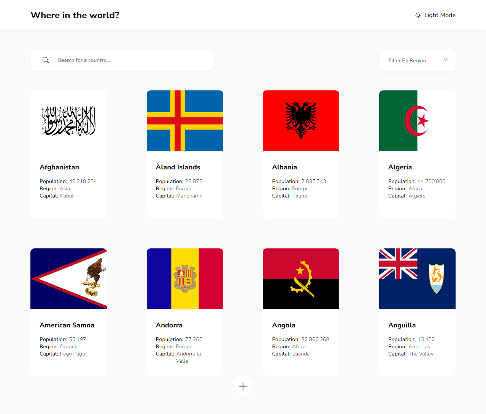

# 🌍 Countries Information App

This is a web application that allows users to explore information about various countries around the world. The app provides detailed data, including population, region, languages, currencies, and more. It is fully responsive and user-friendly, offering a smooth experience across devices.

## Live Demo

You can explore the app live by visiting [Live Demo](https://countries-8z0hnsycg-gokselsayilan.vercel.app/).

## Features

- Search for countries by name.
- View detailed information about each country, including population, region, capital, languages, and currencies.
- Responsive design ensures optimal experience on mobile, tablet, and desktop.
- Dark mode toggle for better user experience.

## How It Works

1. Use the search bar to find a specific country or scroll through the list of countries.
2. Click on a country to view more detailed information about it.
3. Switch between dark and light mode as per your preference.

## Technologies Used

- HTML
- CSS
- JavaScript
- React
- REST Countries API

## Screenshot